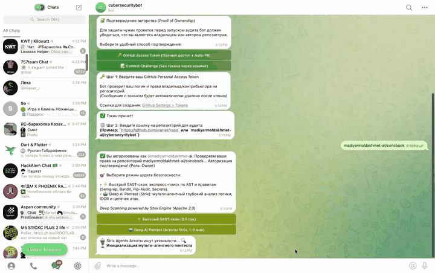

<div align="center">

# 🛡️ CyberSecurityBot
### Autonomous SaaS DevSecOps & AI Pentester Bot

[](https://www.python.org/)
[](https://aiogram.dev/)
[](https://www.docker.com/)
[](https://ai.google.dev/)
[](https://github.com/usestrix/strix)
[](LICENSE)

<p align="center">
  <b>0-Config Telegram-бот для поиска уязвимостей, валидации эксплойтов и автоматического создания Pull Request прямо с мобильного телефона.</b>
</p>

<!-- МЕСТО ДЛЯ ГИФКИ РАБОТЫ БОТА -->


[Ключевые возможности](#-ключевые-возможности) • [Архитектура](#-архитектура) • [Запуск сервера](#-1-click-deploy-docker) • [Сценарий пользователя](#-сценарий-работы-в-telegram) • [Roadmap](#-roadmap)

</div>

---

## 🌟 Зачем нужен CyberSecurityBot?

В эпоху быстрой разработки ("вайбкодинга") проекты часто выходят в продакшн с критическими багами (утечки ключей, SQL-инъекции, IDOR). Разработчикам лень настраивать сложные CI/CD-тулзы и поднимать локальные среды для аудита.

**CyberSecurityBot** решает эту задачу с подходом **0-Config**:
1. Отправь боту ссылку на репозиторий прямо с айфона.
2. Подтверди владение через пустой коммит (без передачи токенов).
3. Облачный ИИ (Strix Engine + Gemini) глубоко проанализирует логику проекта.
4. В один клик ИИ исправит баги и откроет Pull Request на GitHub!

> **SaaS-Ready:** Проект поставляется с готовым `docker-compose` для деплоя на дешевый VPS ($5/мес). Никаких тяжелых нейросетей на локальной машине.

---

## ⚡ Ключевые возможности

| Функция | Описание |
| :--- | :--- |
| 🚀 **Mass-Market UX** | Никаких сложных настроек, `.env` файлов и токенов для конечного пользователя. Всё через кнопки в Telegram. |
| 🔐 **0-Config Verification** | Безопасная верификация авторства через **Commit Challenge** (пользователю нужно сделать 1 пустой коммит). |
| 🤖 **Cloud AI (Gemini)** | Работает на молниеносном API Google Gemini. Окно в 2 млн токенов позволяет анализировать репозитории целиком. |
| 🕵️‍♂️ **Strix Deep Pentest** | Агентный глубокий пентест бизнес-логики, IDOR и цепочек атак на базе движка **Strix** (Apache 2.0). |
| 🌐 **Multi-Language SAST** | Статический анализ Flutter/Dart, Python AST, JS/TS, Firestore Rules и секретов. |
| 🧪 **Exploit PoC Validation** | Автоматическая генерация проверочных cURL-команд (Active DAST) для проверки дыр на "живом" сервере. |
| 🚀 **Auto-PR Generator** | Автоматическое создание изолированной ветки и открытие Pull Request с фиксом уязвимости. |

---

## 🏛 Архитектура (SaaS)

```text
 ┌────────────────────────────────────────────────────────────────────────┐
 │                      END-USER INTERFACE                                │
 │               Telegram Bot (0-Config, Mobile Friendly)                 │
 └───────────────────────────────────┬────────────────────────────────────┘
                                     │
                    [ Commit Challenge Verification ]
                                     │
           ┌─────────────────────────┼────────────────────────┐
           ▼                         ▼                        ▼
 ┌───────────────────┐    ┌────────────────────┐   ┌────────────────────┐
 │     FAST SAST     │    │    DAST ENGINE     │   │ STRIX DEEP PENTEST │
 │ • Multi-Lang AST  │    │ • CSP / HSTS       │   │ • Multi-Agent Recon│
 │ • Semgrep & Bandit│    │ • CORS Reflection  │   │ • Logic & IDOR Flaw│
 └─────────┬─────────┘    └──────────┬─────────┘   └─────────┬──────────┘
           │                         │                       │
           └─────────────────────────┼───────────────────────┘
                                     ▼
                       [ Normalized Findings JSON ]
                                     │
                                     ▼
 ┌────────────────────────────────────────────────────────────────────────┐
 │                     CLOUD AI REMEDIATION ENGINE                        │
 │  • Primary: Google Gemini 2.5 Flash (via API)                          │
 │  • Fallback: Private Local Ollama Cluster (qwen2.5-coder)              │
 └───────────────────────────────────┬────────────────────────────────────┘
                                     │
                    [ Exploit PoC & Patch Generated ]
                                     │
                                     ▼
 ┌────────────────────────────────────────────────────────────────────────┐
 │                     AUTOMATED PULL REQUEST ENGINE                      │
 │    Creates Branch -> Applies Code -> Opens GitHub PR with Summary      │
 └────────────────────────────────────────────────────────────────────────┘
```

---

## 🚀 1-Click Deploy (Docker)

Чтобы поднять платформу и сделать её доступной для тысяч пользователей, нужен только сервер с Docker (хватит самого дешевого за $5/мес).

### 1. Клонирование
```bash
git clone https://github.com/madiyarmoldakhmet-ai/cybersecyritybot.git
cd cybersecuritybot
```

### 2. Настройка (.env)
```bash
cp .env.example .env
```
Вставьте в `.env` свои API ключи:
```env
TELEGRAM_BOT_TOKEN=123456789:ABCdef...
GEMINI_API_KEY=your_gemini_api_key_from_aistudio
LLM_PROVIDER=gemini
```

### 3. Запуск в один клик
```bash
docker-compose up -d
```
Всё! Бот в онлайне 24/7 и готов принимать ссылки на репозитории от пользователей.

*(Опционально: если вы параноик приватности, вы можете запустить бота локально на `Ollama`. Измените `LLM_PROVIDER=ollama` в файле `.env`)*.

---

## 📱 Сценарий работы в Telegram

1. **Запуск**: Пользователь жмет `/start`. Никаких сложных инструкций.
2. **Проверка**: Бот предлагает "🚀 Быстрый старт". Юзер кидает ссылку на гитхаб, бот дает строку для пустого коммита, юзер делает пуш. Проверка пройдена за 10 секунд!
3. **Аудит**:
   * Бот клонирует код во временную папку.
   * **Strix Engine** читает код через облако Gemini (до 150 файлов / 2 МБ за раз).
   * Бот выдает список найденных логических уязвимостей и IDOR.
4. **Лечение (Auto-PR)**:
   * Пользователь жмет "Сгенерировать AI-патч".
   * Бот через ИИ пишет безопасный код и открывает Pull Request на GitHub.

---

## 🌐 FastAPI эндпоинты & Webhooks

Помимо Telegram-интерфейса, внутри крутится `FastAPI`, принимающий хуки от GitHub (Commit Guardian). При каждом коммите в подключенный репозиторий, бот может присылать отчет об аудите в рабочий чат.

Документация Swagger: `http://ваш-сервер:8000/docs`.

---

## 📄 Лицензия

Проект распространяется под лицензией **MIT** (см. [LICENSE](LICENSE)).  
*Deep Scanning powered by Strix Engine (Apache 2.0).*